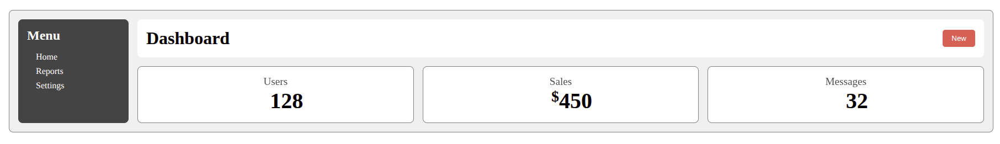

# **Mini-Projekt: „Dashboard mit Sidebar & Card-Bereich“**

Du erstellst:

1. **Hauptlayout** → horizontale Flexbox

   * Links: feste Sidebar
   * Rechts: Inhaltsbereich

2. **Verschachtelte Flexbox innen** → Kartenbereich

   * Header (horizontal)
   * Cards (horizontal, gleiche Höhe)
   * In den Cards selbst nochmals Flexbox für Textausrichtung

Orientiere dich anfolgender Abbildung:

